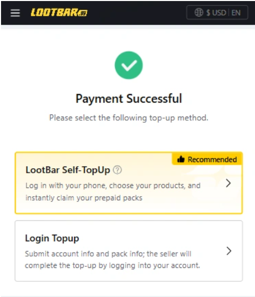
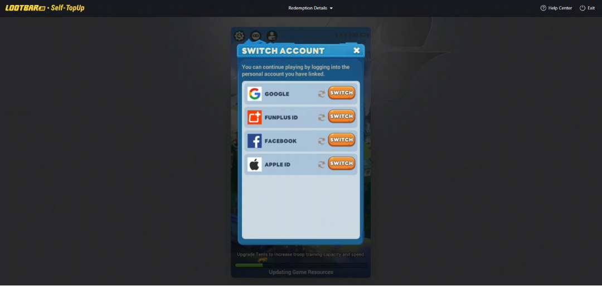
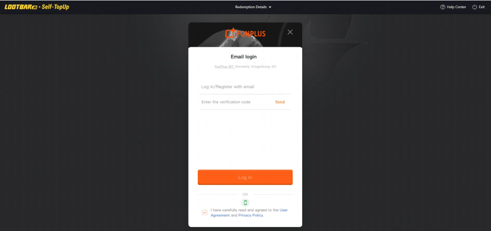
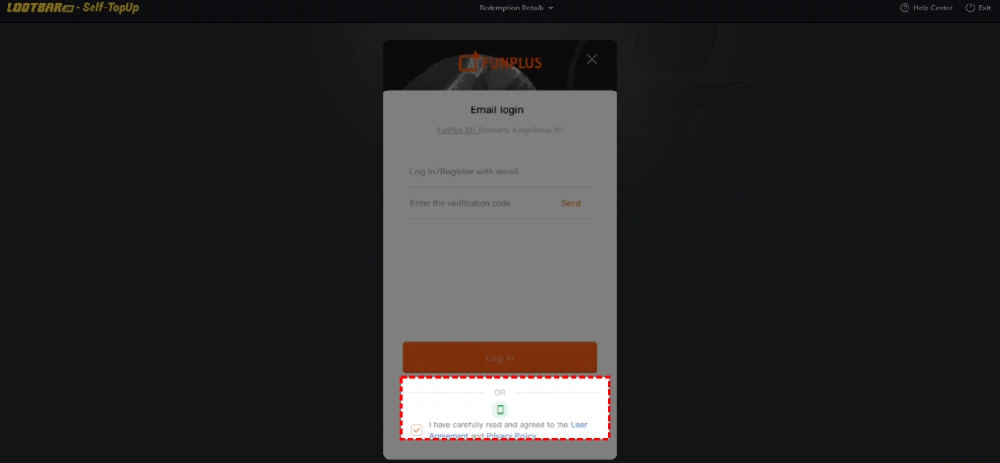
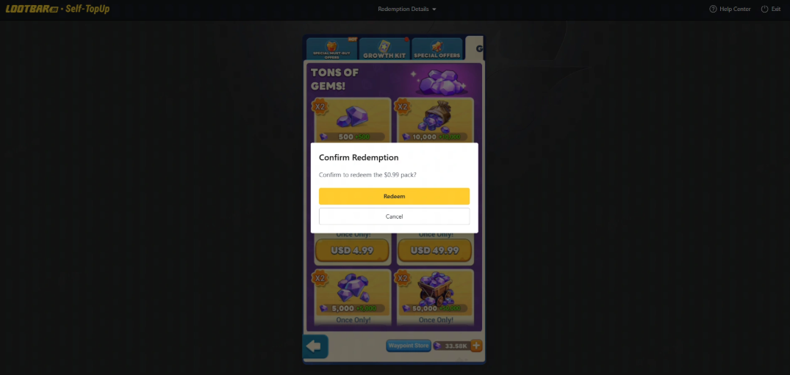
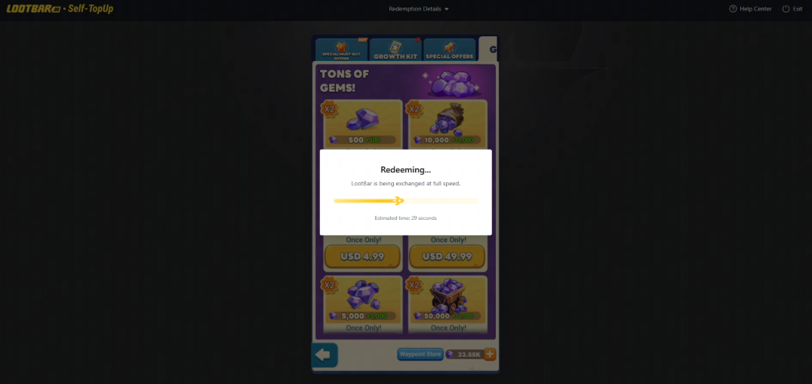
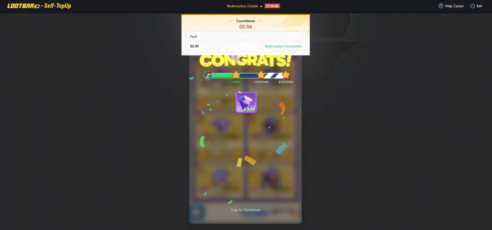

# Инструкция по пополнению LootBar

Пошаговое руководство по покупке игровой валюты и наборов Tiles Survive через платформу LootBar с использованием функции Self-TopUp (Пополнить самостоятельно).

| Параметр | Значение |
|----------|----------|
| 📱 Платформа | Мобильная версия |
| 🌍 Сервер | Международный |
| 🔑 Вход | FunPlus ID |

> **Важно!** Для более быстрого и плавного пополнения рекомендуем использовать ваш **FunPlus ID**. Вход через Apple ID в настоящее время не поддерживается — привяжите учётную запись FunPlus для более быстрой доставки.

---

## Перед началом

Для комфортных покупок при приобретении наборов в игре переключитесь на «Магазин за наличные»!

Если вы хотите купить путевые точки, нажмите на любой набор — вы перейдёте в магазин «Путевые точки» и сможете купить их там.

---

## Процесс пополнения

### Шаг 1: Выберите метод Self-TopUp

После покупки подарочного пакета на LootBar выберите метод **Self-TopUp** (Пополнить самостоятельно).

---

### Шаг 2: Войдите в игровой аккаунт

Войдите в интерфейс игры, войдите в свою учётную запись и перейдите в игровой магазин.

Если вам нужно войти с помощью номера телефона, нажмите на соответствующую кнопку, чтобы переключиться на вход по номеру телефона.

---

### Шаг 3: Подтвердите покупку

Подтвердите информацию о подарочном пакете, который вы хотите приобрести, и получите свой подарочный пакет. Ваша информация для входа будет автоматически удалена после выхода из результатов Self-TopUp.

---

### Шаг 4: Дождитесь завершения

Погашение подарочного пакета требует времени ожидания. Пожалуйста, **не закрывайте интерфейс** и не входите в свою игровую учётную запись с другого устройства во время процесса погашения.

---

### Шаг 5: Проверьте результат

Мы отправим вам уведомление, когда пополнение будет завершено. После этого вы сможете войти в игру, чтобы проверить статус учётной записи и полученные предметы.

---

## Примечания

- Из-за различий в валюте цена пакета в игровом магазине LootBar указана в долларах США. Если вы используете другую валюту, переключите отображаемую валюту на доллары США, чтобы увидеть соответствующую цену. Вы можете выбрать любой пакет с эквивалентной стоимостью.
- Если возникла проблема с Self-TopUp, пожалуйста, свяжитесь со службой поддержки LootBar с информацией о вашей учётной записи.

---

## Награды за первое пополнение

Если вы пополняете Tiles Survive впервые, вы получите дополнительные награды за пополнение в игре. Ознакомьтесь с правилами пополнения в игре для получения подробной информации.

> **Готовы к покупке?** Перейдите на [LootBar](https://lootbar.gg/ru/top-up/tiles-survive?aff_short=dandnagers) и получите скидку до 32%!
